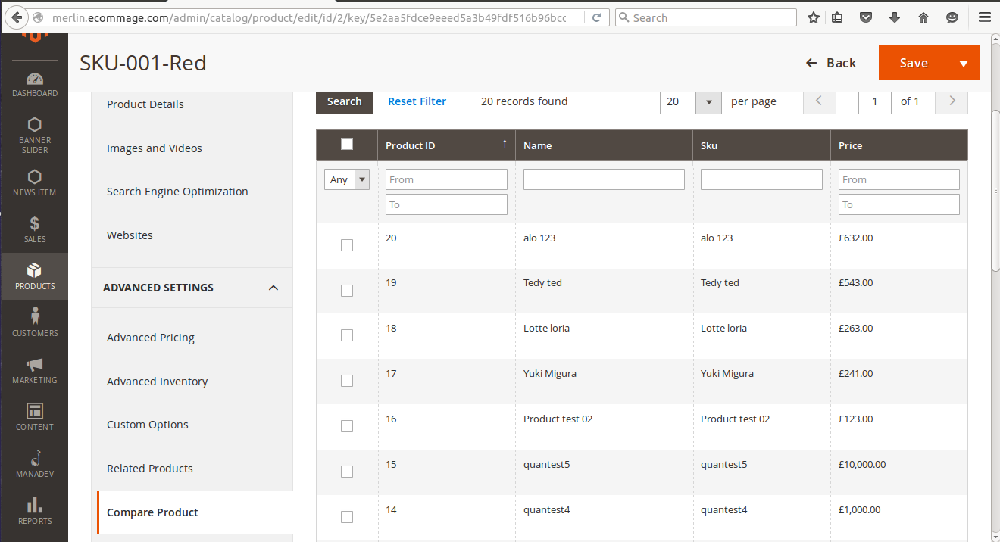

# Magento 2 Assign Products Compare Grid in Admin

This module shows you How to add custom products grid in Magento 2 admin module.

We have created a Magento 2 module with custom database table.This module adds a new table to database that will store the product and products relationship. When you save product, the products attached to the product will be updated in this table.
